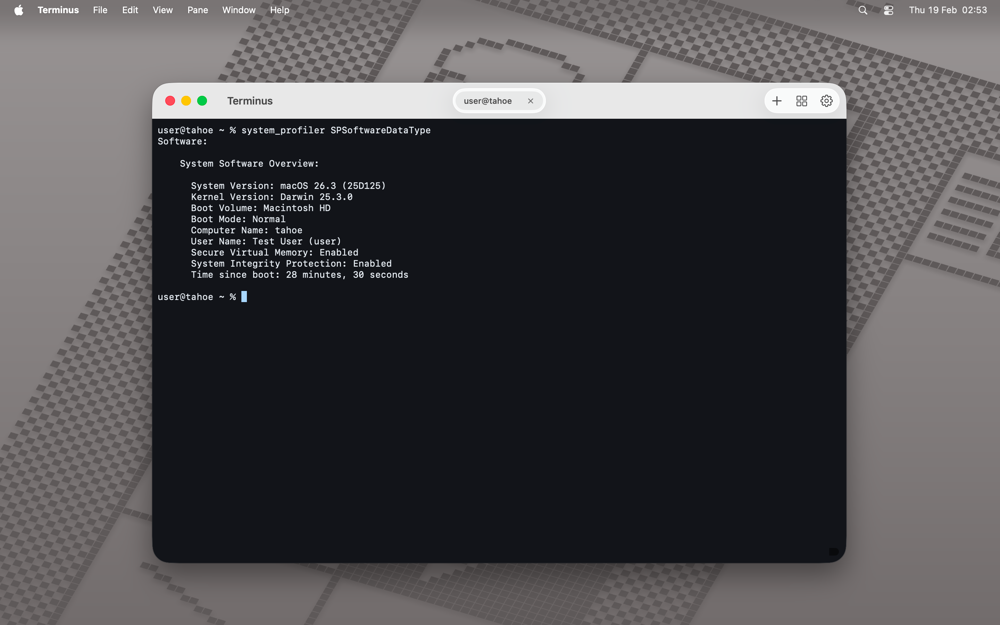
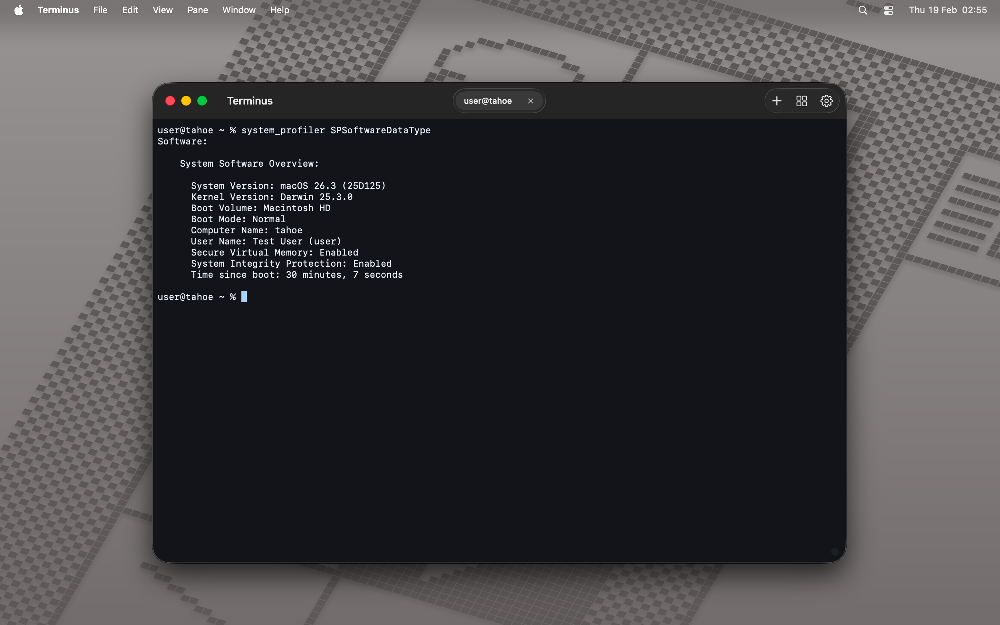

# Terminus

Um emulador de terminal para macOS baseado na biblioteca [SwiftTerm](https://github.com/migueldeicaza/SwiftTerm).

### Pre-requisitos

- macOS 15 (Sequoia) ou superior

### Atalhos

| Atalho | Descrição |
|:------:|------------|
| `⌘D` | Divide o terminal ativo verticalmente |
| `⌘⇧D` | Divide o terminal ativo horizontalmente |
| `⌘⌃W` | Fecha o painel ativo |

### Screenshots

